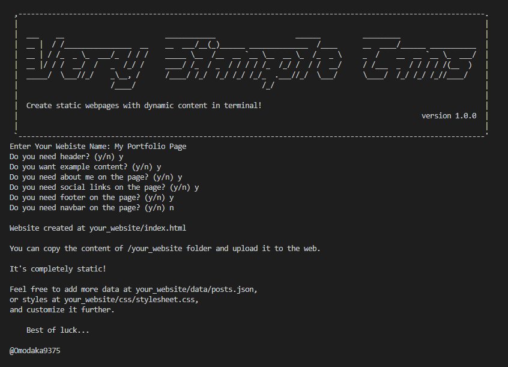
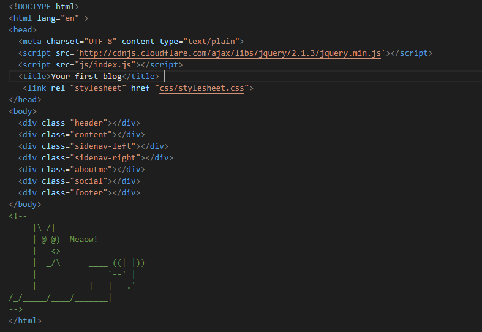

# Very-Simple-CMS

## How to install very-simple-demo

`git clone https://github.com/`

then

`npm install`
## How to use very-simple-demo
`npm run start`
## Customization
You are free to customize css and posts.json to add new content ;)

## Local development (*avoid CORS*)
If you want to preview your website localy in Firefox, you can do so by typing `about:config` in URL.

Then type `security.fileuri.strict_origin_policy` and flip to False. 

## TODO
- Host website to IPFS
- Posts RSS Feed?
- Flex grid design (better template)
## Licence
MIT

